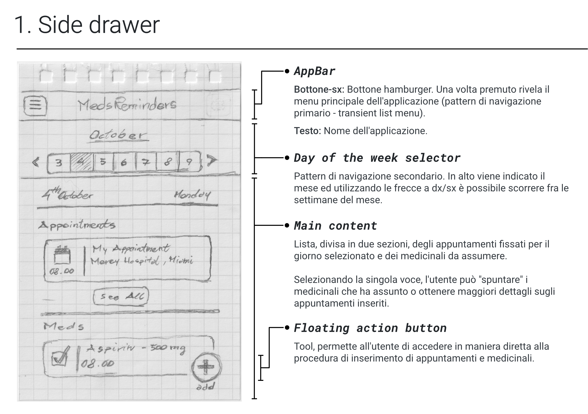

# Mobile Development - Assignment 2

## Specifiche generali
**Nome Applicazione:** MedsReminder
**Tipologia:** Health tracker
**Autore/i:** Eugenio Marzona - Mat. 128623

**Consegna:** Utilizzare gli strumenti visti a lezione per la prototipazione dell'interfaccia utente dell'applicazione mobile scelta per l'assignment 1. Procedere dunque alla valutazione con utenti della stessa.

Viene in ordine richiesto di:
- Produrre *sketch* (su carta) delle schermate principali dell'applicazione, esplorando diverse possibili concept.
- Selezionare le alternative più promettenti (giustificando le scelte effettuate) e convertirle in *wireframe*.
- (Opzionale) Creare un *task flow* che documenti le connessioni tra le diverse schermate e come queste avvengono.
- Sottoporre il prototipo in wireframing a *valutazione con utenti*. Il processo di valutazione va documentato.
- (Opzionale) Creare un prototipo *high-fidelity* dell'applicazione.

---
## 1. Prototype - Sketching
Avendo poca esperienza con le versioni più recenti di android, ho deciso di analizzare alcune delle applicazioni più scaricate della sezione _health_ sul google play store prima di procedere con la vera e propria fase di sketching.

In particolare ho cercato di fare attenzione ai pattern utilizzati, sistemi di interazione non standard e soluzioni di onboarding/tutorial, sia in applicazioni più "generaliste" (Google health, mi fit, samsung health ...) che in applicazioni simili a quella scelta per questo progetto (mypills, drugstars, medisafe ...).

Successivamente ho prodotto sketch per le 3 schermate/route principali dell'applicazione: la schermata _home_, quella degli _appuntamenti_ e quella delle _prescrizioni_ inserite dall'utente.

### 1.1 Home
La schermata home ha la funzione principale di mostrare all'utente appuntamenti ed assunzioni di farmaci previsti per la giornata.

Negli sketch successivi, corredati da note, ho valutato due pattern di navigazione primari e diverse variazioni sulle modalità di presentazione del contenuto.

### 1.2 Medications
La schermata della prescrizioni contiene una lista di tutti i farmaci inseriti dall'utente.

Da qui è possibile effettuare la modifica o la cancellazione di prescrizioni già inserite e/o inserirne di nuove.

**Nota:** La soluzione proposta prevede una serie di pulsanti, ripetuti più volte a schermo, per la cancellazione e modifica delle prescrizioni.

Esistono e si potrebbero considerare diverse soluzioni alternative, fra cui:
- edit/cancellazione con pressione prolungata sull'elemento
- edit/cancellazione con swipe a dx/sx
- action button "Edit" unico per gestire cancellazioni e modifiche, in stile iOS

Queste soluzioni potrebbero comportare problemi di _discoverability_ e/o richiedere un sistema di tutorial.

### 1.3 Appointments
La schermata appointments permette all'utente di consultare la sua agenda virtuale ed inserire nuovi appuntamenti.

---
## 2. Prototype - Wireframes
I wireframe riportati in questa sezione sono stati realizzati utilizzando **Adobe Xd** ed il **Material Design Kit (Light)** offerto da Google per Xd.

Le schermate proposte sono quindi parte di un prototipo interattivo a "media" fedeltà; i componenti grafici, se non realizzati ad-hoc (come il widget del calendario, ad esempio), sono quelli default del kit così come scelte tipografiche e di colore.

Ho cercato di includere, oltre alle schermate principali disegnate in precedenza su carta, anche le schermate secondarie, interazioni importanti, form e dialogs.

### 2.1 Top Level
Le quattro schermate principali dell'applicazione sono di fatto un mix degli elementi che ho reputato migliori negli sketch presentati.

**Home:** La struttura finale proposta mostra all'utente i soli impegni e medicinali da assumere della giornata odierna.

Il sistema di selezione del giorno della settimana è stato omesso per lasciare spazio verticale al contenuto principale. Un sistema di navigazione in stile "calendario" è in ogni caso presente nella schermata omonima.

Come sistema di navigazione principale viene adottata una bottom bar persistente. In questo modo le "pagine" principali sono sempre accessibili all'utente.

Il pulsante "add" è stato spostato all'interno dell'appBar. Un floating action button in un design come quello proposto sarebbe troppo vicino ad altri target toccabili (i pulsanti della bottom bar).

**Calendar:** In questo caso è stato scelto il design in stile "Calendario". La visualizzazione in stile "Planner" è interessante ma probabilmente meno semplice da navigare.

**Medications:** Il design è simile a quanto proposto negli sketch. Selezionando una voce specifica, si accede alla pagina dettagliata della prescrizione e da qui è possibile eseguire le operazioni di cancellazione e modifica.

### 2.2 Forms

L'utilizzo di forms all'interno dell'applicazione è per lo più relativo alle procedure di inserimento e modifica di appuntamenti e medicinali.

Per evitare di inserire form troppo lunghi in un'unica schermata, una volta identificati i campi e parametri necessari (secondo quanto definito nelle feature list dell'applicazione), ho suddiviso entrambe le procedure in diversi step di dimensione più ridotta.

Se l'utente vuole editare una prescrizione o un'appuntamento, seguirà esattamente la stessa procedura ma vedrà i campi del form già compilati.

**Nota:** I dialog e sistemi di input presenti nelle schermate sottostanti hanno l'aspetto dei Material Components (Date e Time Picker) e delle tastiere di sistema Android.

---
## 3. Prototype - Evaluation

La fase di valutazione con utenti è stata effettuata sul prototipo interattivo a bassa/media fedeltà realizzato nella fase di wireframing.

Avendo a disposizione una versione più o meno completa dell'interfaccia ma non definitiva, ho deciso di indirizzare la valutazione soprattutto sugli aspetti di usabilità piuttosto che sugli aspetti emozionali dell'esperienza utente.

### Analisi dei task
In primo luogo ho cercato di identificare i task più rilevanti per l'applicazione.

Quindi ho cercato di darne una stima, in termini di tempo richiesto per portali a termine, tenendo conto delle inefficienze dovute alle condizioni di test e alle limitazioni del prototipo.

I task che ho ritenuto più critici sono stati successivamete selezionati e sottoposti a valutazione.

| Task | T(s) |
|:---|:---:|
| Inserire un nuovo farmaco nella lista delle prescrizioni | 120 |
| Inserire un nuovo appuntamento nel calendario | 120 |
| Attivare/disattivare le notifiche push dell'applicazione | 60 |
| Cambiare la lingua dell'interfaccia utente | 60 |
| Consultare il calendario per cercare un appuntamento inserito in precedenza | 180 |
| Inserire, in modo manuale, l'assunzione di un farmaco | 60 |
| Inserire, in modo manuale, l'assunzione di un farmaco dalla lista dei farmaci da assumere "secondo bisogno" | 90 |
| Rimuovere un farmaco dalla lista delle prescrizioni | 90 |
| Cancellare un appuntamento | 90 |
| Modificare data/ora di un appuntameto | 120 |
| Modificare la lista di reminders associati ad un farmaco | 120 |
| Ottenere informazioni dettagliate su un appuntamento inserito | 60 |
| Ottenere informazioni dettagliate su un farmaco inserito | 60 |

### Selezione degli utenti
L'utente tipo dell'applicazione scelta per questo progetto è una persona sottoposta ad un percorso terapeutico abbastanza complesso da giustificare la necessità di un agenda digitale per tenere traccia di esami e assunzione di farmaci.

Considerati la portata dell'assignment proposto, le risorse disponibili e le difficoltà nell'organizzazione di un esperienza di valutazione con utenza come quella del profilo descritto sopra, mi sono limitato a selezionare utenti che:
- avessero sufficiente dimestichezza con la lingua inglese (scritta)
- avessero dimestichezza con l'utilizzo di uno smartphone

### Metodologia
Per la valutazione è stata seguita una metodologia classica, cercando di attenersi alle indicazioni presentate durante il corso per la valutazione di prototipi cartacei.

All'utenza è stato quindi proposto un test composto di 3 fasi: briefing, esecuzione di una serie di task sul prototipo ed infine un breve questionario per misurare il livello di usabilità.

#### Note sul sistema testato
Agli utenti è stato presentato un prototipo interattivo realizzato con gli strumenti di prototipazione di adobe Xd; questo include la maggior parte dei flussi di interazione ed è stato mandato in preview real-time su un pc portatile.

Così come per i test con prototipi cartacei, nel caso in cui l'utente ha selezionato un elemento della schermata per il quale non è stata prevista una schermata precisa o un'interazione, gli è stato domandato cosa si aspettasse dal sistema ed è stato fatto il tentativo di proporgli la schermata più simile alle sue aspettative.

I test proposti all'utente sono stati fortemente moderati.

#### Briefing
In questa fase è stato spiegato all'utente il sistema testato, utilizzando il System Concept Statement prodotto nella fase di design precedente.

Sono state spiegate all'utente le modalità del test, i tempi di test previsti, le modalità di interazione con il prototipo su Adobe Xd, il ruolo del moderatore e gli è stato spiegato e richiesto di utilizzare il sistema _think aloud_ per la verbalizzazione del suo processo mentale.

#### Parte prima - Tasks
Un insieme di 4 task critici, descritti in maniera dettagliata per guidare al meglio la navigazione all'interno del prototipo, sono stati presentati all'utente in ordine casuale.

Questa scelta è stata effettuata per evitare di far durare il test troppo a lungo e per evitare di assegnare i task nello stesso ordine a tutti gli utenti.

| Task | Nome | Descrizione | 
|:---|:---|:---|
| Task 1 | <i>Consultazione Calendario</i> | Alcuni giorni fa hai inserito nel calendario un appuntamento con il tuo medico di base. Ti ricodi che era previsto per il mese di Novembre ma putroppo hai scordato l'ora e il giorno preciso. Cerca, consultando l'applicazione, di capire la data e ora precisa di questo appuntamento. |
| Task 2 | <i>Cambio lingua</i> | Hai appena installato l'applicazione MedsReminders. Una volta aperta ti accorgi che l'interfaccia utente è in lingua inglese. Tu lo capisci abbastanza bene ma sai, perché lo hai visto sulla pagina del Google Play Store, che l'applicazione è stata localizzata in italiano, che è la tua madrelingua. Cerca, navigando nell'applicazione, di impostare la lingua dell'interfaccia in italiano. |
| Task 3 | <i>Inserimento farmaco</i> | Il tuo medico di base ti ha prescritto un farmaco (Ferrograd, in compresse da 105mg) con l'indicazione di assumerlo due volte al giorno, al mattino e alla sera. Inserisci la tua nuova prescrizione nella lista dei farmaci dell'applicazione MedsReminder ed imposta due reminder per le ore 08.00 e 18.00. |
| Task 4 | <i>Cancellazione farmaco</i> | Hai appena finito il tuo ciclo di cura con il farmaco "Coumadin". Rimuovilo dalla lista dei medicinali che hai inserito nell'applicazione MedsReminder. |

Le conversazioni e le azioni degli utenti sono state registrate utilizzando OBS Studio, previo loro consenso.

#### Parte seconda - Questionario di Usabilità
Per concludere il test, dopo la fase di interazione vera e propria con il sistema, è stato proposto agli utenti un questionario di 14 domande per valutare il livello generale di usabilità.

Il questionario utilizzato è un'adattamento del _System Usability Scale - SUS_.

Il questionario utilizzato è stato incluso nel materiale allegato a questa relazione.

### Risultati
Nelle sezioni successive sono riportati, in forma tabellare, i risultati della valutazione con utenti.

Per quelli che sono sembrati i problemi di usabilità più rilevanti, viene fatta una breve analisi e qualche commento.

#### Tasks - Tasso di successo

| Utente | Task 1 | Task 2 | Task 3 | Task 4 | Successo per partecipante (%) | 
|:---:|:---:|:---:|:---:|:---:|:---:|
| 1 | <strong>Succ.</strong> | <strong>Succ.</strong> | <strong>Succ.</strong> | <strong>Succ.</strong> | 100 |
| 2 | <strong>Succ.</strong> | <strong>Succ.</strong> | <strong>Fail</strong> | <strong>Succ.</strong> | 75 |
| 3 | <strong>Fail</strong> | <strong>Succ.</strong> | <strong>Succ.</strong> | <strong>Succ.</strong> | 75 |
| <strong>Successo tot. (%)</strong> | 66 | 100 | 66 | 100 |  |

#### Questionari - Risultati

| Utente | Età | Sistema Principale | Ha mai utilizzato un sistema simile per funzionalità a quello implementato? | Quale? | SUS | NPS | 
|:---:|:---:|:---:|:---:|:---:|:---:|:---:|
| 1 | 24 | Android | <strong>Sì</strong> | Calendario Google | 95 | Promotore |
| 2 | 25 | iOS | <strong>Sì</strong> | Agenda cartacea | 67.5 | Passivo |
| 3 | 25 | iOS | <strong>Sì</strong> | Calendario di sistema e app promemoria | 77.5 | Passivo |
| <strong>Punteggi tot</strong> |  |  |  |  | 80 | 33 |

**Scoring e interpretazione dei punteggi**

I Risultati riportati nella precedente tabella sono stati calcolati utilizzando il metodo di scoring del questionario SUS e NPS, riporto i riferimenti a due risorse che descrivono la metodologia in modo efficace.

- **SUS:** https://xd.adobe.com/ideas/process/user-testing/sus-system-usability-scale-ux/
- **NPS:** https://www.qualtrics.com/uk/experience-management/customer/net-promoter-score/

I valori rilevati mostrano un livello genereale di usabilità "buono", ma sono stati raccolti su un campione numericamente poco significativo.

Il punteggio NPS complessivo, probabilmente poco affidabile in una misurazione come quella effettuata, si assesta su valori "Medi".

#### Analisi dei problemi di Usabilità

##### 1 - Indicatore di appuntamento su widget calendario

**Descrizione:** L'indicatore sul widget "calendario" indica all'utente che uno o più appuntamenti sono stati fissati nel corso di una specifica giornata.

Ha bassa visibilità e non viene correttamente interpretato dagli utenti, ostacolando la consultazione degli appuntamenti.

**Gravità:** Alta

**Occorrenza:** 33%

**Note:** L'utente 3, alla fine del processo di valutazione mi ha informalmente comunicato che si aspettava di trovare una funzione di ricerca all'interno del calendario, come nel calendario di sistema iOS.

La funzione non è stata considerata in fase di design dell'applicazione ma potrebbe effettivamente semplificare la consultazione del calendario.

**Soluzioni:** Rivedere le cues visive scelte per indicare questo tipo di informazione all'utente.

##### 2 - Poca chiarezza nelle etichette del form per l'inserimento dei farmaci

**Descrizione:** La schermata 3 del form per l'inserimento dei farmaci propone all'utente un reminder opzionale per avvisarlo che la sua scorta di farmaci si sta esaurendo.

Le etichette scelte per comunicare questa feature all'utente non sono particolarmente chiare (forse anche per una questione di barriera linguistica, avendo scelto di sottoporre agli utenti un prototipo in lingua inglese).

**Gravità:** Alta

**Occorrenza:** 33%

**Soluzioni:** Rivedere le etichette che descrivono la terza schermata del form e i suoi campi.

##### 3 - Interazioni non previste ma attese nella schermata home

**Descrizione:** L'utenza, posta di fronte al task di rimuovere un particolare farmaco dalla lista delle prescrizioni attive, vede il nome del medicinale nella lista presente nella schermata home e cerca di accedere alle funzioni di cancellazione/modifica tappandoci sopra.

**Gravità:** Bassa

**Occorrenza:** 33%

**Soluzioni:** Valutare se l'aggiunta di una funzione di accesso diretto alla modifica/cancellazione di farmaci e appuntamenti dalla schermata home, magari con tap prolungato, può migliorare l'esperienza utente.

### Commenti finali
Per quanto eseguito su un numero esiguo di partecipanti, la valutazione con utenti effettuata ha permesso di rivelare alcuni chiari problemi di usabilità che possono facilmente essere corretti prima dell'implementazione vera e propria dell'applicazione.

Le metriche di usabilità calcolate con i questionari rivelano una situazione di usabilità percepita accettabile ma sono probabilmente poco affidabili su una valutazione effettuata con meno di 5-10 utenti.